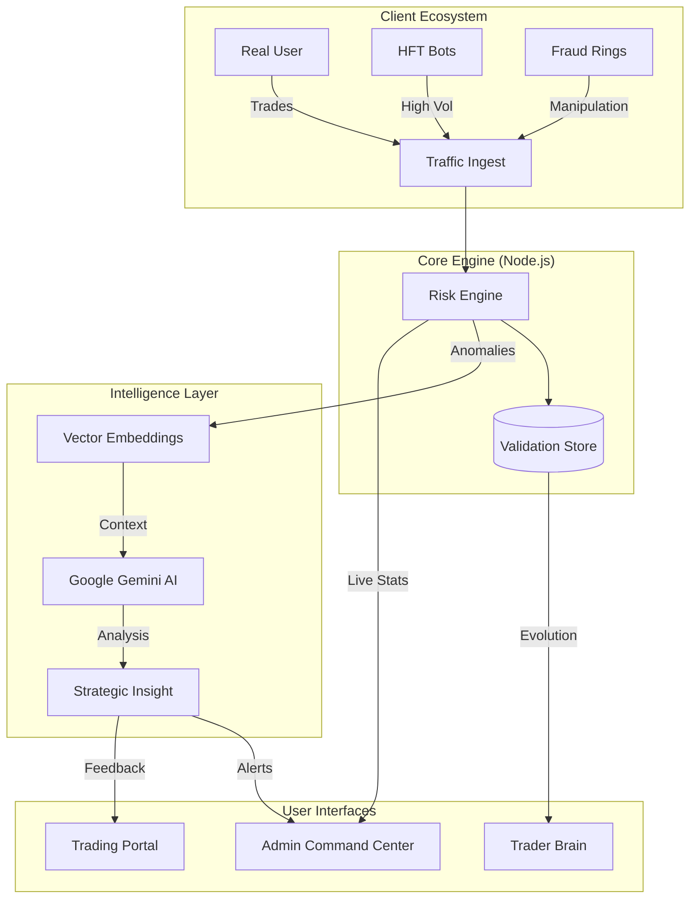

# 🤖 AI Payment & Trading Intelligence Platform

> **Enterprise-Grade High-Frequency Trading Simulation & Real-Time Fraud Detection System**

  

## 📺 Project Demo
<!-- REPLACE THIS LINK WITH YOUR YOUTUBE VIDEO -->
[](https://www.youtube.com/watch?v=YOUR_VIDEO_ID)

---

## 🏗️ System Architecture

This platform simulates a high-frequency trading ecosystem where legitimate traders, HFT algorithms, and fraudsters interact. The core engine processes thousands of transactions per second, using **Vector Embeddings** and **Machine Learning** to detect fraud patterns in real-time.



---

## 🔑 Access Credentials

### 🛡️ Admin Command Center
Monitor entire network, view real-time fraud detection, and approve/reject payouts.
- **URL**: `/` (Main Dashboard)
- **Username**: `admin`
- **Password**: `admin123`

### 📈 Trading Portal (Client)
Execute trades, view AI analysis, and track trader evolution.
- **URL**: `/client` (or `/trading` after login)

| Role | Username | Password | Features |
|------|----------|----------|----------|
| **Legitimate Trader** | `john_trader` | `demo123` | Standard trading, low risk |
| **HFT Algo** | `hft_mike` | `demo123` | High volume, fast execution |
| **New User** | `new_sarah` | `demo123` | Limited history, manual review |
| **Fraudster** | `black_ops` | `shadow` | Market manipulation, "Pump & Dump" |

---

## 🚀 How to Use

### 1. The Trading Portal
1.  **Login** as `john_trader`.
2.  **Execute Trades**: Buy/Sell stocks in the terminal.
3.  **AI Analysis**: After closing a trade, click the ✨ icon to see **Gemini AI** analysis of your move.
4.  **Trader Brain**: Click "Patterns" in the sidebar to see your evolution timeline and skill level.

### 2. The Admin Dashboard
1.  **Login** as `admin`.
2.  **Live Monitoring**: Watch the **Real-Time Graph** to see transactions flowing.
    - 🟢 Green: Safe
    - 🔴 Red: High Risk / Fraud
3.  **Queue Management**: Go to "Queue" to manually review flagged payout requests.
4.  **AI Insights**: Click "Copilot" to ask the AI about specific suspicious users.

### 3. Fraud Simulation
1.  Login as `black_ops`.
2.  Execute a "Pump and Dump" pattern (Buy high volume, Sell immediately).
3.  Switch to **Admin Dashboard**.
4.  Observe the system flagging this activity as **"Market Manipulation"** in real-time.

---

## 🛠️ Technology Stack

- **Frontend**: React, Vite, TailwindCSS, Framer Motion
- **Backend**: Node.js, Express, WebSocket
- **AI/ML**: Google Gemini Pro (GenAI), Tensor Embeddings (Simulation)
- **Data**: JSON Persistence (NoSQL-style), D3.js Visualization
- **Deployment**: Railway / Vercel

---

## ⚠️ Performance Note & Limitations

Please note that this is a **Demonstration Prototype**. The backend is intentionally simplified for portability:
- **Single-Threaded**: The Node.js server handles Simulation, AI Analysis, and WebSocket broadcasts in a single process. Heavy load (100+ concurrent simulated users) may cause latency.
- **JSON Persistence**: Trade history is stored in local JSON files instead of a high-performance database (like PostgreSQL/Redis). This limits write speeds.
- **Cold Starts**: Services deployed on free-tier platforms (Railway/Render) may spin down after inactivity, causing a 30-60s delay on first request.

**Future Scaling Plan:**
- Migrate to **Microservices** (separate Order Matching Engine vs. Fraud Service).
- Replace `trades.json` with **PostgreSQL + TimescaleDB**.
- Implement **Redis Caching** for real-time market data.

---

### 📦 Installation (Local)

```bash
git clone https://github.com/your-repo/ai-payment-process.git
cd ai-payment-process
npm install
npm run dev
```

Remember to set your `GEMINI_API_KEY` in `.env` or Railway variables!
